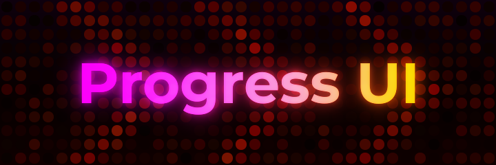

  
[**Examples**](example.lua) - [**API Reference**](api.md) - [**Icon Reference**](./icons-reference.md) - [**Alert Type Reference**](alerts-reference.md)

Welcome to the documentation for the Progress UI library!
Here you can find full documentation of the API, examples, and references for alert and icon types.

Click on any of the classes in the tree below to explore its API:

(API)
	(Base Object)
		(Base Component)
			Hub
			Login
			Window
			(Base Display)
				Category
				Page
				Section
				(Base Element)
					Alert
					Label
					(Base Interactable)
						Button
						(Base Value)
							ColorPicker
							Dropdown
							Slider
							TextBox
							Toggle
