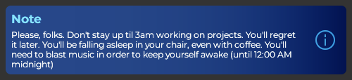
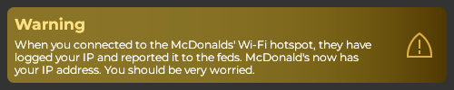
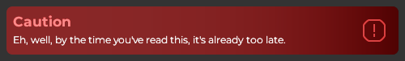

# Alert Types
These are inspired from [GitHub's alerts](https://docs.github.com/en/get-started/writing-on-github/getting-started-with-writing-and-formatting-on-github/basic-writing-and-formatting-syntax#alerts)
## 0: Unset
This alert doesn't have a type, and is used for a fallback when no alert type is passed. Can be used for a generic message as an alternative to [Label](classes/Label.md).

## 1: Note
Useful information that users should know, even when skimming content.

## 2: Tip
Helpful advice for doing things better or more easily.

## 3: Important
Key information users need to know to achieve their goal.

## 4: Warning
Urgent info that needs immediate user attention to avoid problems.

## 5: Caution
Advises about risks or negative outcomes of certain actions.

