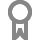
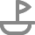
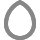
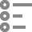
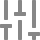
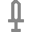

# Icon Reference

50 original, high-quality icons icons are available for display in tabs. Currently, tabs are the only visual component that can display these icons, but there may be more that support displaying them in the future. All tab icons were created on a 20x20 pixel grid.

| Icon                                              | Name       | Example Use Cases              |
| ------------------------------------------------- | ---------- | ------------------------------ |
|              | atom       |                                |
|            | award      | Badge farming                  |
|                | axe        | Chopping, Auto-chop            |
|    | bar-chart  | Game Stats                     |
|    | bell-ring  | Webhooks, Alerts               |
|              | boat       | Boat-based actions             |
|            | boost      | Speed boost                    |
|  | check-mark |                                |
|          | circle     |                                |
|              | code       |                                |
|                | cog        | Script settings                |
|      | crescent   | Night-related actions          |
|    | crosshair  | Aimbot, Range                  |
|              | cube       | Object-related actions         |
|        | diamond    |                                |
|          | dollar     | Buying/Selling, Economy        |
|                | egg        | Farming                        |
|              | fist       | Fighting                       |
|                | gem        | Premium features               |
|            | ghost      | Spectating                     |
|              | gift       | Redeeming gift codes           |
|              | hand       | Information, Credits           |
|  | headphones | Sound-based cues               |
|            | heart      |                                |
|              | home       | Self-actions                   |
|                | imp        | Evil actions >;)               |
|              | info       | Information                    |
|    | lightning  | Powerful, OP actions           |
|              | list       | List of objects in the game    |
|              | lock       |                                |
|    | lock-open  |                                |
|        | map-pin    | Locations, Teleports           |
|    | meridians  |                                |
|            | minus      | Removing items                 |
|          | pencil     | Editing, Creating              |
|          | person     | Self-actions                   |
|        | pickaxe    | Mining, Auto-mine              |
|              | play       |                                |
|              | plus       | Adding items                   |
|          | shield     | Protection, Raids, Event farms |
|        | shield2    |                                |
|            | skull      | Instant-kill, Deadly actions   |
|        | sliders    | Configuration                  |
|        | sparkle    | Decorative actions             |
|            | swirl      | Teleports, Portals             |
|            | sword      | Fighting, Auto-fight           |
|          | target     | Aim                            |
|            | trash      | Deletion, Removal              |
|      | up-arrow   | Upgrades                       |
